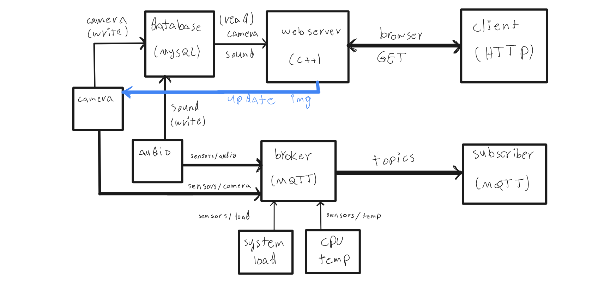

# Simple Home Automation System
In this project I'm building a simple home automation system, capable of handling camera, sound, and sending general information within a house. Codes are written in C++ to be optimized for embedded devices and to be portable. A simple webserver is written can handle `GET` requests. This webserver sends a simple webpage to the client, which can be used to control the system. User can asks for last n'th records of image and audio database and a nice-looking table is shown to her (`Bootstrap` is used to achieve that). Webserver uses `Beast` library from `Boost` library to handle requests. Also, `MySQL` is the database to store data in it. 

Another communication mechanism is `MQTT` protocol. This protocol is used to send data from embedded devices to the server. `Mosquitto` is the broker used in this project. 

## Components
The following picture shows a simple diagram of the system as a whole:


### [Camera](./src/Camera.cpp)
This module detectes motion and if number of human faces in the consecutive frames changes, it takes a picture and saves it so if user asks for last image, it can be shown to her. This module is written in C++ and uses `OpenCV` library to detect motion and faces. Furthermore, this violoation is sent to the client with `MQTT` protocol and is saved in the database (`camera` table). 

### [Sound](./services/detectSoundThr.sh)
Detection of sound is done by a microphone. If the sound is loud enough (above a threshold), the violation and the time is sent to the client with `MQTT` protocol and is saved in the database (`sound` table).

### [CPU Temperature Monitor](./services/getCPUTemp.sh)
CPU temperature is read from `/sys/class/thermal/thermal_zone0/temp` file. The temperature is sent to the client with `MQTT` protocol in real time. However, user can set a time interval to send the temperature to the client. This is done to save bandwidth.

### [System Load Monitor](./services/getSystemLoad.sh)
This module acts like CPU temperature module. It sends system load to the client in real time. However, user can set a time interval to send the load to the client. 

For all of the above modules, a service is written to run them in the background. These services are written in `bash` and are run by `systemd` service manager.

## Requirements
1. `MariaDB` or `MySQL` database
2. `Mosquitto` broker
3. `Boost` library
4. `OpenCV` library
5. `sox` tool: install with `sudo apt install sox`


## How to run
First of all you need to install requirements. Then create a database named `sensors` and create two table `sound` and `camera` in it. The default password for the user that has access to `sensors` database is `123456`. Feel free to change it in the code. 

After compiling the code with `cmake`, run the server on a specific port and ip address. For example:
```bash
$ ./runServer.sh 0.0.0.0 1234
```
Then you can get the client webpage by visiting this address in your browser:
```
localhost:1234/index.html
```

Now you can start the services. First, move the `services` directory to `/etc/systemd/system` directory. Then run the following commands:

```bash
$ sudo systemctl daemon-reload
$ sudo systemctl start emb-webserver.service
$ sudo systemctl start audio-level.service
$ sudo systemctl start cpu-temp.service
$ sudo systemctl start system-load.service
```
Make sure that you have changed the path to scripts and executables correctly in your system.

Services send data on `sensors/camera`, `sensors/audio`, `sensors/temp` and `sensors/load` topics. You can subscribe to these topics to see the data. 

## Results
Refer to this [video](./imgs/system-execution.mp4) to see the results. The movie lags a bit, but the reason is not the code. It's because of the recording software and high load on the system.
